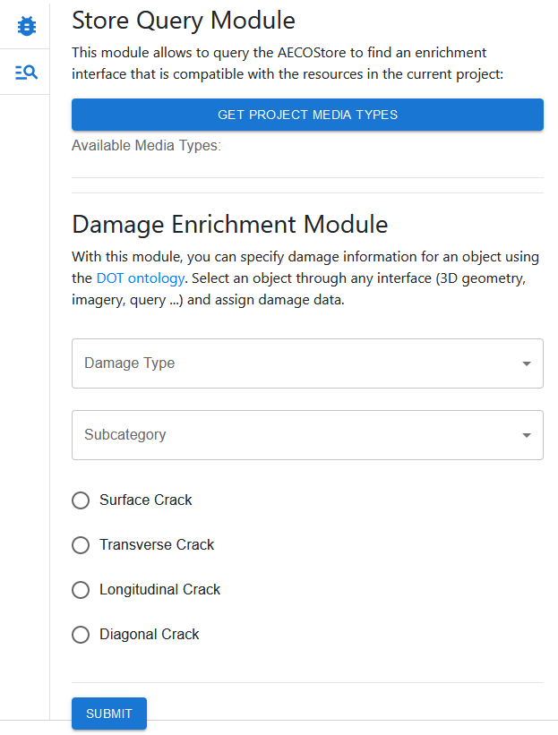

# Tabs module
A module for hosting extension modules in a tab-like fashion.

# Mifesto: Tabs Module
This is a micro-frontend "organisational" module that allows to host other micro-frontend modules in a tab-like fashion. the module does not expose any GUI of its own, but only provides a framework for other modules to render into. The below image shows a Tabs Component that hosts a [Query Module](https://github.com/AECOstore/query-module) and a [Damage Module](https://github.com/AECOstore/damage-module). Modules may expose an icon that allows the Tabs Module to visualise them in a lint. 

## About Mifesto
Mifesto (Micro-Frontend Store) is an experimental framework for federation of micro-frontends. It is a work in progress and is not yet ready for production use. Micro-frontend modules expose the following: 

* a manifest file that describes the module and its dependencies
* loadable code which may be injected into a "bundler" application

The bundler application is responsible for loading the micro-frontend modules and providing a framework for them to interact with each other. The bundler application is also responsible for providing an interface for the micro-frontend modules to render into. Mifesto modules may or may not be compatible with the [ConSolid ecosystem](https://content.iospress.com/articles/semantic-web/sw233396), or generally with AEC multi-models. To be useful for interacting with multi-models, a minimal functionality is required. This functionality is described in the [Mifesto documentation]().